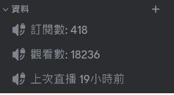

# Discord 顯示 Youtube 狀態
實現使用 Discord 頻道來顯示 Youtube 狀態 !!!
這是一個用 __discord.py__ 編寫的 cog。 </br>
由於我想要在Discord中顯示Youtube訂閱數，但是上網找了一圈沒發現用python寫的，或者是有但我看不懂?，於是就自己寫了一個出來!</br>
使用了 Google Youtube API V3 來獲取Youtube資料</br>

實際用於 [__@桐 Azusa Ch.__ ](https://youtube.com/@azusa1109?si=SojTYmUg4sfJdrax) 的 [__DC伺服器__](https://discord.com/invite/bvNkPNfRcn)  (~~快去訂閱他~~

## 功能
顯示訂閱數，觀看數，距離上次直播時間 </br>



## 如何使用
1. 將 `youtube_state.py` 放入你的cogs  </br>
2. 將 `youtubeAPI.py ` 放入根目錄 ( 如果放其他地方，`youtube_state.py`內的import記得改 </br>
3. 設定好 config.ini</br>
4. 機器人，啟動!!

## config.ini
以下需要自行填，其他在 data/config.ini
```
[Youtube_API]
API_KEY =   #Youtube API V3 的 API KEY</br>
CHANNEL_ID  =   #Youtube 頻道ID
VEDIO_PLAYLIST_ID =  #底下解釋

[Youtube_state]
youtube_id =  #Youtube 頻道ID
subscriber_channel_ID =  #顯示訂閱數的DC頻道ID
view_channel_ID = #顯示觀看數的DC頻道ID
lastlive_channel_ID = #顯示距離上次直播的DC頻道ID
```
`VEDIO_PLAYLIST_ID` 可以透過將這串網址放到瀏覽器 https://youtube.googleapis.com/youtube/v3/channels?part=contentDetails&id=UC_x5XG1OV2P6uZZ5FSM9Ttw&key=[YOUR_API_KEY]  (記得加入你的API_KEY) ，將會得到類似以下JSON:
``` JSON
{
  "kind": "youtube#channelListResponse",
  "etag": "D5mgxfufdD2TnZyRAt2yy_X3DRk",
  "pageInfo": {
    "totalResults": 1,
    "resultsPerPage": 5
  },
  "items": [
    {
      "kind": "youtube#channel",
      "etag": "tjfVDNBL4GkV4fzZBO9NE36KY5o",
      "id": "UC_x5XG1OV2P6uZZ5FSM9Ttw",
      "contentDetails": {
        "relatedPlaylists": {
          "likes": "",
          "uploads": "UU_x5XG1OV2P6uZZ5FSM9Ttw"    <----- 就是這個!!
        }
      }
    }
  ]
}
```
